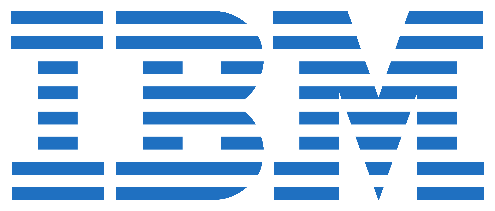
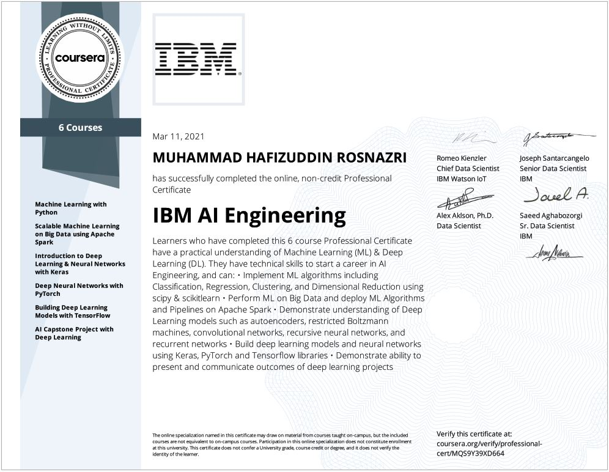

# IBM AI Engineering Professional Certificate

 

 

## About this Professional Certificate

Artificial intelligence (AI) is revolutionizing entire industries, changing the way companies across sectors leverage data to make decisions. To stay competitive, organizations need qualified AI engineers who use cutting-edge methods like machine learning algorithms and deep learning neural networks to provide data driven actionable intelligence for their businesses. This 6-course Professional Certificate is designed to equip you with the tools you need to succeed in your career as an AI or ML engineer.  

You’ll master fundamental concepts of machine learning and deep learning, including supervised and unsupervised learning, using programming languages like Python. You’ll apply popular machine learning and deep learning libraries such as SciPy, ScikitLearn, Keras, PyTorch, and Tensorflow to industry problems involving object recognition, computer vision, image and video processing, text analytics, natural language processing (NLP), recommender systems, and other types of classifiers.

Through hands-on projects, you’ll gain essential data science skills scaling machine learning algorithms on big data using Apache Spark. You’ll build, train, and deploy different types of deep architectures, including convolutional neural networks, recurrent networks, and autoencoders.

In addition to earning a Professional Certificate from Coursera, you will also receive a **digital badge from IBM** recognizing your proficiency in AI engineering. 

## Applied Learning Project
Throughout the program, you will build a portfolio of projects demonstrating your mastery of course topics. The hands-on projects will give you a practical working knowledge of Machine Learning libraries and Deep Learning frameworks such as SciPy, ScikitLearn, Keras, PyTorch, and Tensorflow. You will also complete an in-depth Capstone Project, where you’ll apply your AI and Neural Network skills to a real-world challenge and demonstrate your ability to communicate project outcomes. 

**Course Link**: [IBM AI Engineering Professional Certificate](https://www.coursera.org/professional-certificates/ai-engineer)

## Specialization Overview

| Sr. No | Course                                                        |
|:------:|---------------------------------------------------------------|
|    1   | Machine Learning with Python                                  |
|    2   | Scalable Machine Learning on Big Data using Apache Spark      |
|    3   | Introduction to Deep Learning & Neural Networks with Keras    |
|    4   | Deep Neural Networks with PyTorch                             |
|    5   | Building Deep Learning Models with TensorFlow                 |
|    6   | AI Capstone Project with Deep Learning                        |

## Instructors
- Saeed Aghabozorgi
- Joseph Santarcangelo
- Romeo Kienzler
- Alex Aklson
- Samaya Madhavan
- Jeremy Nilmeier

## Professional Certificate

 

## Digital Badge                     

